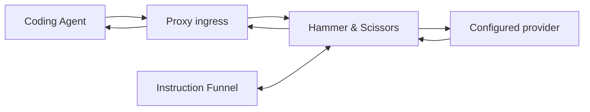

# Proxy Mode Overview

Jungent gives your agent wings.

## Product Statement

Jungent Proxy Mode lets a coding agent use a configured AI provider through a local, protocol-compatible proxy while Jungent improves the information exchanged in both directions.

## Architecture



## Endpoints

| Endpoint | Purpose |
| --- | --- |
| `POST /v1/chat/completions` | OpenAI-compatible agent ingress |
| `GET /health` | Process liveness only |
| `GET /ready` | Configuration, module, and upstream readiness |

## Configuration

```json
{
  "mode": "proxy",
  "proxy": {
    "host": "127.0.0.1",
    "port": 8787,
    "protocol": "openai-chat-completions",
    "upstream_provider": "openai",
    "default_model": "configured-model-id",
    "module_timeout_ms": 15000,
    "module_failure_mode": "open",
    "session_ttl_seconds": 3600,
    "max_request_bytes": 4194304
  },
  "modules": {
    "hammer_scissors": {
      "enabled": true,
      "pipeline": ["instruction_funnel"]
    },
    "instruction_funnel": {
      "enabled": true,
      "decision_provider": "openai",
      "decision_model": "configured-decision-model-id",
      "max_context_tokens": 200000
    }
  }
}
```

## CLI Usage

```bash
jungent proxy --host 127.0.0.1 --port 8787 --provider openai --model gpt-4o
```

## Environment Variables

| Variable | Description | Default |
| --- | --- | --- |
| `JUNGENT_PROXY_HOST` | Host to bind to | 127.0.0.1 |
| `JUNGENT_PROXY_PORT` | Port to bind to | 8787 |
| `JUNGENT_UPSTREAM_PROVIDER` | Upstream provider ID | openai |
| `JUNGENT_DEFAULT_MODEL` | Default model ID | - |
| `JUNGENT_AUTH_TOKEN` | Local bearer token (required for non-loopback) | - |

## Supported Features

- OpenAI-compatible `POST /v1/chat/completions` ingress
- Multi-turn tool use with full request/response structures
- Non-streaming requests (streaming in development)
- Three upstream providers: OpenAI, Anthropic, Google

## Limitations

- Task-result grading not included
- Autonomous task planning not included  
- Durable cross-process memory not included
- Web UI not included
- Multi-node deployment not included
- Billing features not included
- Support for 30+ providers not included (only currently implemented adapters)

## Security

- Never expose upstream API keys to client or logs
- Local authentication required on non-loopback interfaces
- Request size limits enforced
